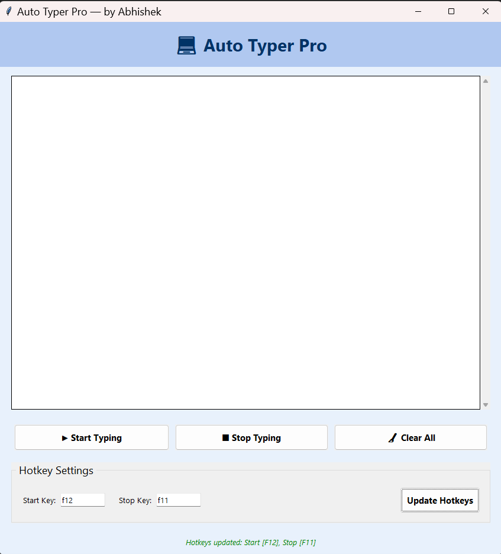

# 💻 AutoTyper Pro — Desktop App

AutoTyper Pro is a **desktop automation tool** built with Python & Tkinter that automatically types code/text into any window at high speed.  
Just paste your code into the app → press a hotkey → the text is typed automatically.

---

## ✨ Features

| Feature | Description |
|--------|-------------|
| 🚀 Auto typing | Types text/code into any active window automatically.
| ⌨ Custom Hotkeys | Set your own **Start** and **Stop** hotkeys.
| 🎨 Code Syntax Highlighting | Highlights Python keywords, strings, comments, functions, numbers.
| 🧽 Clear Button | Quickly remove all text in the editor.
| ⚙ Saved Settings | Hotkeys are saved in `config.json`, so they persist after restart.
| UI Built with Tkinter | Simple clean UI with scrollable code editor.

---

## 📁 Project Structure

```
AutoTyper-Pro/
│
├── autotyper_pro.py        # Main application UI and logic
├── requirements.txt        # Dependencies (pyautogui, keyboard)
└── config.json             # Auto generated - saves user hotkeys
```

---

## 🔧 Installation & Setup (Windows / Mac / Linux)

### 1️⃣ Clone or download this repository

```sh
git clone https://github.com/<your-username>/AutoTyper-Pro.git
cd AutoTyper-Pro
```

### 2️⃣ Install dependencies

> Python 3.10+ recommended

```sh
pip install -r requirements.txt
```

Dependencies included in requirements file:

```
pyautogui
keyboard
```

> ✅ Tkinter comes preinstalled with Python on Windows/macOS.  
> Linux users may need:

```sh
sudo apt install python3-tk
```

---

## ▶️ Run the App (VS Code or Terminal)

### **Option 1 — Run using VS Code**

1. Open the folder in VS Code
2. Open `autotyper_pro.py`
3. Click **Run ▶** in the top right  
   _or press_ `F5`

---

### **Option 2 — Run using Terminal**

```sh
python autotyper_pro.py
```

---

## 🧠 How to Use

| Step | Action |
|------|--------|
| 1 | Paste / type text into the editor window
| 2 | Press **Start typing** button or your hotkey
| 3 | Switch to the target window (Notepad, Chrome, VS Code, etc.)
| 4 | AutoTyper will start typing line by line automatically
| 5 | Press Stop hotkey to stop typing anytime

---



---

## 🔑 Hotkeys

| Function | Default Key |
|----------|------------|
| ▶ Start AutoTyping | `F12`
| ⏹ Stop AutoTyping | `F11`

You can change them from the app UI:

> **Hotkey Settings → Enter new keys → Update Hotkeys**

Hotkeys get saved into `config.json`.

---

## ❓ Troubleshooting

### ❌ PyAutoGUI or keyboard not typing?

Run Python as administrator:

```
Right click → Run as administrator
```

### ❌ Keyboard module errors on macOS/Linux?

You may need:

```sh
sudo python3 autotyper_pro.py
```

---

## 🧑‍💻 Author

👤 **Abhishek**

If you like this project, ⭐ star the repo 😊
